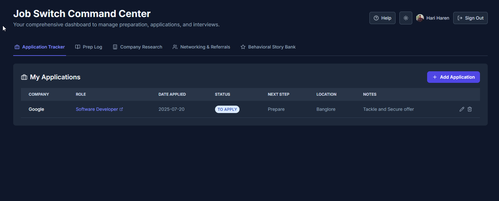

# 🚀 JobTrac - Your Ultimate Job Switch Command Center

**JobTrac** is a sleek, production-ready, all-in-one dashboard designed to streamline and organize every facet of your job search. From tracking applications to preparing for interviews, JobTrac is the command center you need to conquer your next career move.



---

## ✨ Key Features

### 🔐 **Dual Authentication Options**
-   **Google Sign-In:** Full-featured experience with profile data synchronization
-   **Anonymous Mode:** Quick access without account creation - try before you commit!

### 📊 **Core Modules**
-   **📝 Application Tracker:** Monitor your job applications from "To Apply" to "Offer." Never lose track of an opportunity again.
-   **📚 Prep Log:** Document your interview preparation sessions. Track topics, time spent, and rate your confidence to identify areas for improvement.
-   **🏢 Company Research:** Store in-depth research on target companies, including their values, your motivations, and key questions to ask during interviews.
-   **🤝 Networking & Referrals:** Manage your professional contacts, track outreach, and note who has provided referrals.
-   **⭐ STAR Story Bank:** Build a powerful arsenal of behavioral interview answers using the STAR (Situation, Task, Action, Result) method.
-   **📝 Smart Notes:** Advanced note-taking system with markdown support, multiple pages, and real-time sync.

### 📱 **Mobile-First Design**
-   **Fully Responsive:** Card-based layouts on mobile, detailed tables on desktop
-   **Touch-Optimized:** 44px minimum touch targets and smooth interactions
-   **Cross-Device Sync:** Real-time data synchronization across all your devices

### 🎨 **User Experience**
-   **🌙 Dark & Light Mode:** Beautiful, modern interface with theme toggle
-   **🔄 Real-Time Updates:** Live data sync with Firestore
-   **✏️ Full CRUD Operations:** Add, view, edit, and delete entries seamlessly
-   **🚀 Production Polish:** Error boundaries, loading states, and smooth animations
-   **❓ Comprehensive Help:** Built-in help system accessible from anywhere

---

## 🛠️ Tech Stack

-   **Frontend:** [React](https://reactjs.org/) & [TypeScript](https://www.typescriptlang.org/)
-   **Build Tool:** [Vite](https://vitejs.dev/)
-   **Styling:** [Tailwind CSS](https://tailwindcss.com/)
-   **Backend & Database:** [Firebase](https://firebase.google.com/) (Firestore & Authentication)
-   **Icons:** [Lucide React](https://lucide.dev/guide/react)

---

## 🚀 Getting Started

Follow these instructions to get a copy of the project up and running on your local machine for development and testing purposes.

### Prerequisites

-   [Node.js](https://nodejs.org/en/) (v18 or higher recommended)
-   [npm](https://www.npmjs.com/) or [yarn](https://yarnpkg.com/)

### Installation & Setup

1.  **Clone the repository:**
    ```sh
    git clone https://github.com/your-username/jobtrac.git
    cd jobtrac
    ```

2.  **Install dependencies:**
    ```sh
    npm install
    # or
    yarn install
    ```

3.  **Set up environment variables:**
    -   Create a `.env` file in the root of the project by copying the example file:
        ```sh
        cp .env.example .env
        ```
    -   Open the `.env` file and replace the placeholder values with your actual Firebase project credentials. You can find these in your [Firebase project console](https://console.firebase.google.com/).

4.  **Run the development server:**
    ```sh
    npm run dev
    # or
    yarn dev
    ```

The application should now be running on `http://localhost:5173` (or another port if 5173 is in use).

---

## 📜 Available Scripts

In the project directory, you can run the following commands:

-   `npm run dev`: Runs the app in development mode.
-   `npm run build`: Builds the app for production to the `dist` folder.
-   `npm run lint`: Lints the codebase using ESLint to find and fix problems.
-   `npm run preview`: Serves the production build locally to preview it.

---

## 📂 Project Structure

The project is organized with a clear separation of concerns to make it easy to navigate and maintain.

```
/
├── public/
├── src/
│   ├── assets/
│   ├── components/   # Reusable React components
│   ├── config/       # Firebase configuration
│   ├── data/         # Initial/mock data
│   ├── hooks/        # Custom React hooks (useAuth, useFirestore, etc.)
│   ├── types/        # TypeScript type definitions
│   └── utils/        # Utility functions
├── .env.example      # Environment variable template
├── .gitignore
├── index.html
├── package.json
└── README.md
```
---

## 📊 Application Architecture

### **Frontend Architecture**
- **Component-Based:** Modular React components with TypeScript
- **Custom Hooks:** Reusable logic for authentication, data fetching, and theme management
- **State Management:** React hooks with optimized re-renders
- **Type Safety:** Full TypeScript implementation with strict typing

### **Backend & Database**
- **Firebase Firestore:** NoSQL document database with real-time capabilities
- **Firebase Authentication:** Secure user management with multiple providers
- **Firebase Security Rules:** Server-side data protection and validation
- **Offline Support:** Built-in offline capabilities with Firestore

### **Data Models**
```typescript
// Core application data structures
interface Application {
  id: string;
  company: string;
  role: string;
  status: ApplicationStatus;
  date: string;
  // ... additional fields
}

interface PrepEntry {
  id: string;
  topic: string;
  confidence: number;
  time: number;
  // ... additional fields
}

// Additional interfaces for Company Research, Networking, STAR Stories
```
---

## 🌐 Deployment

### **Firebase Setup**
1. Create a new Firebase project at [Firebase Console](https://console.firebase.google.com/)
2. Enable Authentication with Google and Anonymous providers
3. Create a Firestore database with the following collections:
   - `applications`
   - `prepEntries` 
   - `companies`
   - `contacts`
   - `stories`
   - `userNotes`
4. Set up Firestore security rules to ensure user data isolation
5. Copy your Firebase config to the `.env` file

### **Production Build**
```bash
# Build for production
npm run build

# Preview production build locally
npm run preview

# Deploy to your preferred hosting service
# (Vercel, Netlify, Firebase Hosting, etc.)
```
---

## 💖 Credits

Built with love by [Hariharen](https://hariharen9.site/) - Cloud Application Developer

---

## 🤝 Contributing

Contributions are what make the open-source community such an amazing place to learn, inspire, and create. Any contributions you make are **greatly appreciated**.

1.  Fork the Project
2.  Create your Feature Branch (`git checkout -b feature/AmazingFeature`)
3.  Commit your Changes (`git commit -m 'Add some AmazingFeature'`)
4.  Push to the Branch (`git push origin feature/AmazingFeature`)
5.  Open a Pull Request

---

## 📄 License

Distributed under the MIT License. See `LICENSE` for more information.
