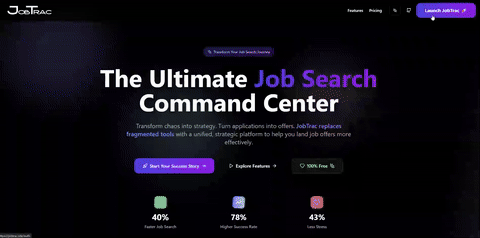

<div align="center">

  <h1>🎯 JobTrac</h1>
  
  <p>
    <strong>The Ultimate Job Search Command Center</strong><br>
    <em>Transform chaos into strategy. Turn applications into offers.</em>
  </p>
  
  <p>
    <a href="https://jobtrac.site/" target="_blank">
      
    </a>
    <a href="https://github.com/hariharen9/jobtrac/stargazers">
      
    </a>
    <a href="https://github.com/hariharen9/jobtrac/blob/main/LICENSE">
      
    </a>
    <br>
    <a href="https://github.com/hariharen9/jobtrac/actions/workflows/test-and-build.yml">
      
    </a>
    
    <a href="eslint.config.js">
        
    </a>
    <a href="CONTRIBUTING.md">
      
    </a>
    <a href="https://drive.google.com/file/d/1Yj9Ygg--BnXFu0--GbwAxf8PGxvI72F2/view?usp=sharing" target="_blank">
  
</a>
  </p>
</div>

---

## 🌟 Why JobTrac Changes Everything

> *"JobTrac isn't just another application tracker. It's the strategic co-pilot that transforms your job search from scattered chaos into a precision-engineered campaign."*

<div align="center">
  
</div>

---


### 💡 The Problem It Solves

-   **From Scattered to Strategic:** Replaces messy spreadsheets, random notes, and forgotten contacts with a unified command center.
-   **From Anxiety to Confidence:** A structured preparation suite turns interview jitters into confident execution.
-   **From Guesswork to Insight:** Data-driven analytics show you what's working, so you can double down on success.

---

## 🏆 Core Features

<div align="center">
<table>
<tr>
<td width="45%">

### 🎯 **Application Pipeline**
**Kanban-Style Visualization**
- Drag-and-drop status management
- Visual pipeline from "To Apply" → "Offer"
- Activity calendar with timeline view
- Job description storage & quick access

</td>
<td width="45%">

### 📚 **Interview Mastery Suite**
**Systematic Preparation System**
- Prep log with confidence tracking
- STAR story bank for behavioral interviews
- Topic-based study session management
- Real-time confidence metrics

</td>
</tr>
<tr>
<td width="45%">

### 🏢 **Company Intelligence**
**Strategic Research Hub**
- Company culture & values database
- Key contact relationship mapping
- Interview insights & preparation notes

</td>
<td width="45%">

### 🤝 **Networking Powerhouse**
**Relationship Management System**
- Contact database with interaction history
- Outreach tracking & follow-up reminders
- Referral opportunity management

</td>
</tr>
</table>
</div>

### ✨ A Modern, User-First Experience

| Feature                 | Description                                                              |
| :---------------------- | :----------------------------------------------------------------------- |
| 🚀 **Onboarding**       | Get started in seconds with an interactive welcome wizard and demo mode.            |
| 📱 **Responsive Design**| A seamless experience on desktop, tablet, and mobile.                    |
| 🎨 **Theming**          | Switch between Light, Dark, and AMOLED themes for your comfort.          |
| ⌨️ **Power Tools**      | Navigate like a pro with the Command Palette (`Cmd+K`) and keyboard shortcuts and Smart Global Search!. |
| 🌐 **Landing Page**     | A beautiful, informative landing page to welcome users to the project.   |
| 🔄 **Data Portability** | Easily import from CSV or export your data for complete ownership.       |


<br>
<sub><b>JobTrac</b></sub>
<br><br>
<details>
<summary><h2>🖼️ Click to expand more Screenshots</h2></summary>
<br>


<br>
<sub><b>Landing Page</b></sub>
<br><br>

<br>
<sub><b>Auth</b></sub>
<br><br>

<br>
<sub><b>Applications</b></sub>
<br><br>

<br>
<sub><b>Calander & Kanban</b></sub>
<br><br>

<br>
<sub><b>Networking</b></sub>
<br><br>

<br>
<sub><b>Preplog</b></sub>
<br><br>

<br>
<sub><b>Research</b></sub>
<br><br>

<br>
<sub><b>STAR</b></sub>
<br><br>

</details>

---

<details>
<summary><h3>🔽 Click to Explore All Power-User Tools</h3></summary>
<br>

### **🚀 Command Palette**

| **Shortcut** | **Action** | **Description** |
|:------------:|:----------:|:---------------:|
| `Cmd/Ctrl + K` | Open Command Palette | Universal search, quick actions, and global data discovery |
| `↑` `↓` | Navigate Commands | Move up and down in command list |
| `Enter` | Execute Command | Run the selected command or open selected data |
| `Escape` | Close Palette | Exit command palette |

---

### **📍 Tab Navigation**

| **Shortcut** | **Tab** | **Feature** |
|:------------:|:-------:|:-----------:|
| `Cmd/Ctrl + 1` | Applications | Job application tracker with Kanban board |
| `Cmd/Ctrl + 2` | Prep Log | Interview preparation and study sessions |
| `Cmd/Ctrl + 3` | Research | Company intelligence and insights |
| `Cmd/Ctrl + 4` | Networking | Professional contacts and referrals |
| `Cmd/Ctrl + 5` | STAR Stories | Behavioral interview preparation |

---

### **🔧 Utility Commands**

| **Shortcut** | **Action** | **Description** |
|:------------:|:----------:|:---------------:|
| `Cmd/Ctrl + H` | Help & Guide | Open comprehensive help documentation |
| `Cmd/Ctrl + P` | Profile & Analytics | View profile, goals, and success metrics |
| `Cmd+Option+T` / `Ctrl+Shift+T` | Toggle Theme | Switch between light, dark, and amoled themes |
| `Cmd+Option+N` / `Ctrl+Shift+N` | Toggle Notes | Show or hide the notes panel |

---

### **⚡ Quick Actions (via Command Palette)**

| **Command** | **Shortcut** | **Action** |
|:-----------:|:------------:|:----------:|
| "Add New Application" | `Cmd/Ctrl + K` → Type "add app" | Create new job application entry |
| "Add Prep Session" | `Cmd/Ctrl + K` → Type "add prep" | Log interview preparation session |
| "Add Company Research" | `Cmd/Ctrl + K` → Type "add company" | Create company research entry |
| "Add Contact" | `Cmd/Ctrl + K` → Type "add contact" | Add networking contact |
| "Add STAR Story" | `Cmd/Ctrl + K` → Type "add story" | Create behavioral interview story |
---

### **📝 Smart Search Features**

- **Universal Search**: Type 2+ characters to search across ALL your data.
- **Smart Results**: Company names, roles, topics, contacts, notes - everything indexed.

- **Quick Navigation**: Click any result to jump directly to that item for editing.

</details>

---

## 📈 Competitive Advantage

| Feature                  | JobTrac                               | Spreadsheets       | Other Trackers   |
| :----------------------- | :------------------------------------ | :----------------- | :--------------- |
| **Application Tracking** | ✅ Kanban + Timeline                  | ❌ Manual rows      | ✅ Basic lists     |
| **Interview Preparation**| ✅ Integrated system                  | ❌ Separate tools   | ❌ Not included  |
| **Company Intelligence** | ✅ Research hub                        | ❌ Random notes     | ❓ Limited        |
| **Networking Management**| ✅ Contact system                      | ❌ Phone contacts   | 🚯 Separate app   |
| **Analytics & Insights** | ✅ Visual dashboard                    | ❌ Manual charts    | ⛔️ Basic stats    |
| **Mobile Experience**    | ✅ Native-like                         | ❌ Desktop only     | 🚫 Poor mobile    |

<br>

<table align="center">
  <tr>
    <td align="center" width="33%">
      <br>
      <sub><b>General UI</b></sub>
    </td>
    <td align="center" width="33%">
      <br>
      <sub><b>Authentication</b></sub>
    </td>
    <td align="center" width="33%">
      <br>
      <sub><b>Onboarding</b></sub>
    </td>
  </tr>
  <tr>
    <td align="center" width="33%">
      <br>
      <sub><b>Kanban Board</b></sub>
    </td>
    <td align="center" width="33%">
      <br>
      <sub><b>Calendar View</b></sub>
    </td>
    <td align="center" width="33%">
      <br>
      <sub><b>Prep Log</b></sub>
    </td>
  </tr>
  <tr>
    <td align="center" width="33%">
      <br>
      <sub><b>Research, Networking, STAR</b></sub>
    </td>
    <td align="center" width="33%">
      <br>
      <sub><b>Command Palette</b></sub>
    </td>
    <td align="center" width="33%">
      <br>
      <sub><b>Theming and Profile</b></sub>
    </td>
  </tr>
</table>

---

## 🌍 Community & Open Source

### 💖 Our Open Core Promise

JobTrac is, and always will be, fundamentally free and open-source.

-   **Everything is Free, Right Now:** All currently available features are free to use without limitation.
-   **Self-Hosted is Always Free:** When you self-host JobTrac, you will **always have access to all features**, including any future premium ones.
-   **Future `JobTrac Pro`:** To support the project's development, we plan to introduce a hosted, premium `JobTrac Pro` service for users who want advanced, cloud-based features (like team collaboration, AI insights, etc.) without the need to self-host.

### ⭐ Why Star This Repository?
If you find JobTrac useful, please consider giving it a star! It's a simple way to show your appreciation and helps the project gain visibility in the community. More stars mean more contributors and a better tool for everyone. Thank you for your support!

### **Contributing to Success**
We welcome contributors of all levels! Check out our [`CONTRIBUTING.md`](CONTRIBUTING.md).

<div align="center">

<p>
  <a href="https://github.com/hariharen9/jobtrac/issues">
    
  </a>
  <a href="https://github.com/hariharen9/jobtrac/pulls">
    
  </a>
</p>

[](https://star-history.com/#hariharen9/jobtrac&Date)

</div>

---

## 🔧 Built with Modern Excellence

<div align="center">

<p>
  
  
  
  
  
  
</p>

</div>

JobTrac is built with a focus on scalable architecture, real-time data sync, and an engaging, accessible user experience.

---

## ⚡ Quick Start ( For DEVs )

```bash
# 1. Clone the repository
git clone https://github.com/hariharen9/jobtrac.git && cd jobtrac

# 2. Install dependencies
npm install

# 3. Configure Firebase (optional for demo)
cp .env.example .env

# 4. Launch the app
npm run dev
```

---

<div align="center">
  <p> If you find my work helpful, consider supporting me!</p>
  <p>
    <a href="https://www.buymeacoffee.com/hariharen" target="_blank"></a>
    <a href="https://paypal.me/thisishariharen" target="_blank"></a>
  </p>
</div>

---
<div align="center">

### **Ready to Transform Your Career Journey?**

<p>
  <a href="https://jobtrac.site/" target="_blank">
    
  </a>
</p>
<p>
  <a href="https://drive.google.com/file/d/1Yj9Ygg--BnXFu0--GbwAxf8PGxvI72F2/view?usp=sharing" target="_blank">
  
</a>

</p>

---

<p>
  <strong>Built with 💜 by</strong><br>
  <a href="https://hariharen9.site/">
    
  </a>
</p>

<p>
  <em>"Empowering careers, one application at a time."</em>
</p>

<p align="center">
  
</p>
</div>